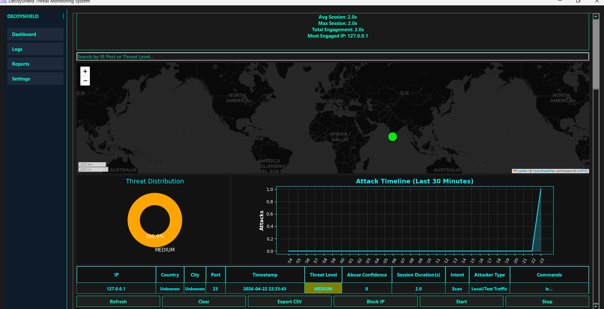
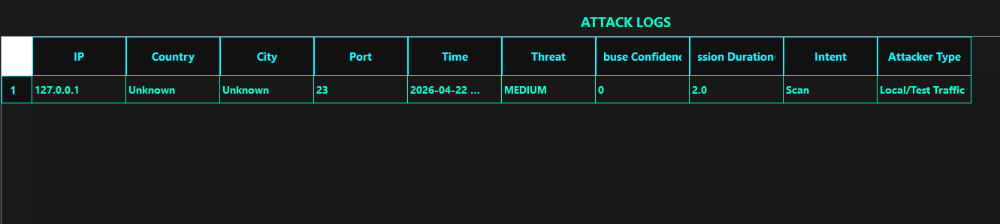
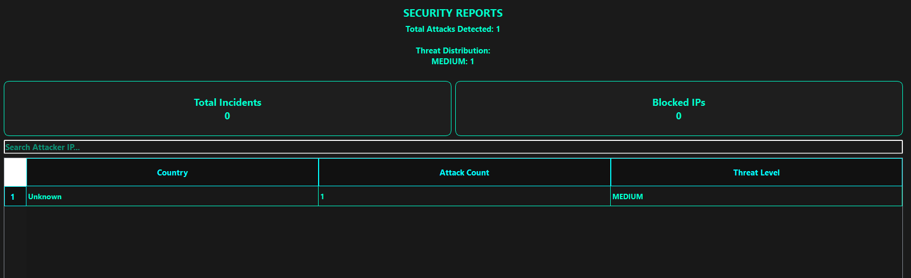

# DecoyShield – Honeypot-Based Cybersecurity System

## 📌 Overview

DecoyShield is a modular honeypot-based cybersecurity system designed to detect, analyze, and respond to suspicious network activity in a controlled environment.

It simulates vulnerable services to attract potential attackers and monitors their behavior to gain insights into attack patterns, intent, and threat levels.

---
## 🧾 Project Type
**Group Mini Project** (Academic)

Developed as part of a team project to explore honeypot-based cybersecurity concepts.


## 🚀 Features

* Multi-threaded port monitoring across dynamic ports
* Real-time attack detection and logging
* Threat scoring system (LOW / MEDIUM / HIGH)
* Integration with AbuseIPDB for IP reputation analysis
* Geolocation and hostname resolution
* Attacker behavior and intent analysis
* Interactive fake shell (sandbox) for high-risk attackers
* Port knocking mechanism for authorized access
* CLI-based dashboard for monitoring attack data

---

## 📷 Screenshots

### 🔹 Dashboard



### 🔹 Logs



### 🔹 Reports



---

## ⚙️ Technologies Used

* Python
* Socket Programming
* SQLite
* Requests library

---

## 🧠 System Workflow

1. The system listens on multiple ports
2. Detects incoming connections
3. Analyzes attacker behavior and frequency
4. Assigns a threat level (LOW / MEDIUM / HIGH)
5. Responds dynamically:

   * Fake banners for low-level threats
   * Deception responses for medium threats
   * Interactive sandbox for high-risk attackers
6. Logs all activity into a database for analysis

---

## ▶️ How to Run

### 1. Install Python

Make sure Python is installed on your system.

### 2. Install dependencies

```bash
pip install requests
```

### 3. Set environment variables

#### Windows:

```bash
set ABUSE_API_KEY=your_api_key
set SENDER_EMAIL=your_email
set APP_PASSWORD=your_app_password
set RECEIVER_EMAIL=your_email
```

#### Linux / Mac:

```bash
export ABUSE_API_KEY=your_api_key
export SENDER_EMAIL=your_email
export APP_PASSWORD=your_app_password
export RECEIVER_EMAIL=your_email
```

### 4. Run the project

```bash
python main.py
```

---

## 🔐 Security Considerations

* API keys and email credentials are not stored in code
* Environment variables are used for secure configuration
* Designed for controlled testing environments only

---

## 🚧 Limitations

* Runs locally (127.0.0.1 environment)
* Not deployed on a public server
* Database resets on each run (testing mode)

---

## 🔮 Future Improvements

* Cloud deployment (AWS / VPS)
* Advanced anomaly detection
* Machine learning-based threat classification
* Enhanced GUI dashboard
* Real-time alert notifications

---

## 👤 Author

**Naja Sherin M**

---
